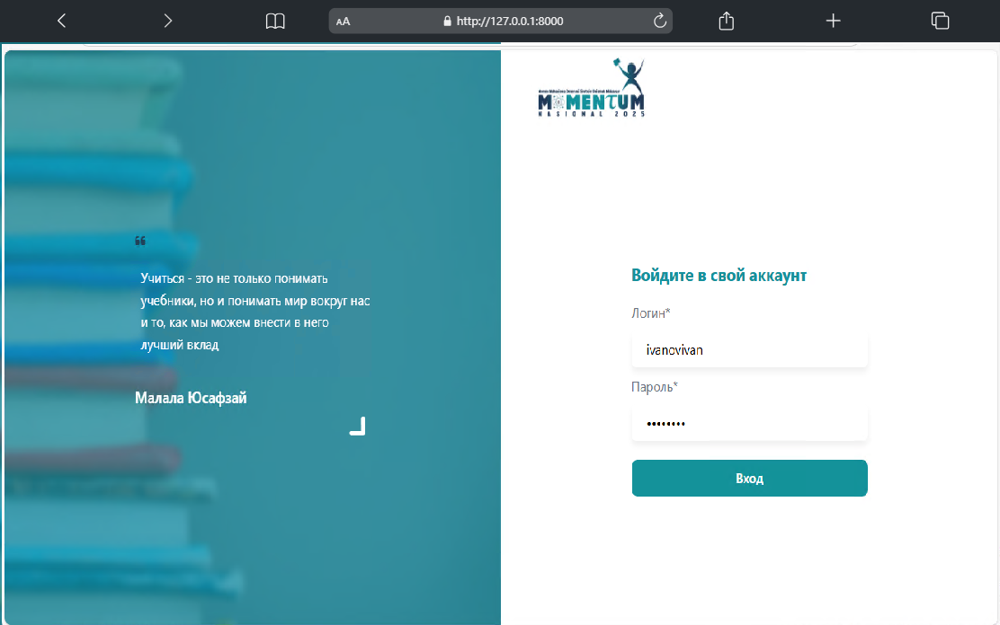
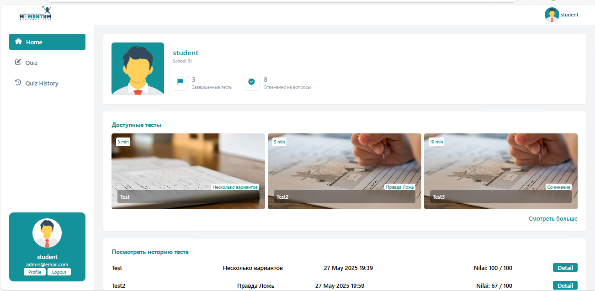
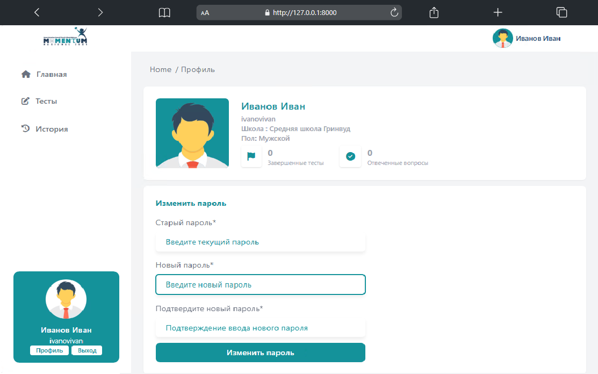
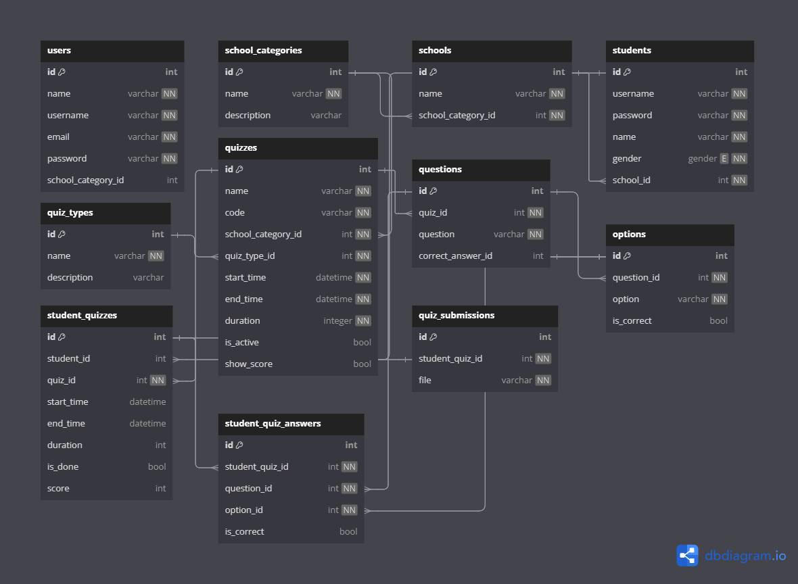

# Momentum - сайт для тестирования учеников 🚜🌾

Momentum - это сайт компьютерных тестов, разработанный для облегчения проведения тестов в режиме онлайн. Сайт поддерживает три основные роли: **Администратор**, **Администратор школы** и **Ученик** с полным и современным набором функций.

---

## Характеристики ✨

### Администратор

- **Управление данными школы:** Добавление, изменение и удаление данных школы.
- **Управление данными учеников:** Добавление, изменение и удаление данных учеников.
- **Управление учетными записями администраторов школ:** Создание и управление учетными записями администраторов для конкретных школ.
- **Создание викторины:**
    - Добавьте название, код, категорию школы (SMP/SMA), тип викторины (множественный выбор, эссе, верно/неверно).
    - Укажите время начала, время окончания и продолжительность экзамена.
    - Введите вопросы для созданной викторины.
- **Подведение итогов викторины:**.
    - Просматривайте сводку результатов теста по студентам.
- **Мониторинг экзамена в реальном времени:**.
    - Отслеживайте состояние студентов в режиме онлайн/оффлайн.
    - Просматривайте количество ответов на вопросы и оставшееся время для каждого студента.

### Школьный администратор

- **Управление данными об учениках и викторинах:** Аналогичные функции, как и у главного администратора, но ограниченные школами, которыми они управляют.

### Студент

- **Экзамен:**
    - Введите код теста, чтобы начать сдавать экзамен.
    - Время работы ограничено в соответствии с настройками администратора.
- **История тестов:** Просмотр списка тестов, в которых вы принимали участие, а также информации о результатах.

---

## Технологический стек 🛠️

-   **Frontend:** Livewire 3, Alpine.js, Tailwind CSS
-   **Backend:** Laravel 10
-   **Database:** MySQL
-   **Realtime Communication:** Pusher & Laravel WebSockets
-   **Admin Panel:** Laravel Filament
-   **Deployment:** GitHub Actions

---

## Необходимые условия 🛠️

Убедитесь, что у вас есть:

-   PHP 8.1 или выше
-   Composer
-   Node.js & NPM
-   MySQL
-   Git

---

## Установка 🛠️

1.  Клонируйте этот репозиторий:
    ```bash
    git clone https://github.com/HodoGo/momentumRu.git
    cd momentumru
    ```
2.  Установите зависимости с помощью Composer:
    ```bash
    composer install
    ```
3.  Установите зависимости Node.js:
    ```bash
    npm install
    npm run build
    ```
4.  Скопируйте файл `.env.example` в файл `.env`:
    ```bash
    cp .env.example .env
    ```
5.  Установите соединение с базой данных в файле `.env`:
    ```bash
    DB_CONNECTION=mysql
    DB_HOST=127.0.0.1
    DB_PORT=3306
    DB_DATABASE=nama_database
    DB_USERNAME=nama_user
    DB_PASSWORD=password
    ```
6.  **Конфигурация связи в реальном времени**.  
    Добавьте следующие настройки в файл `.env`:
    ```bash
    PUSHER_APP_ID=
    PUSHER_APP_KEY=
    PUSHER_APP_SECRET=
    PUSHER_HOST=
    PUSHER_PORT=
    PUSHER_SCHEME=
    PUSHER_APP_CLUSTER=
    ```
7.  Запустите миграцию базы данных:
    ```bash
    php artisan migrate --seed
    ```
8.  Сгенерируйте ключ шифрования приложения с помощью команды:
    ```bash
    php artisan key:generate
    ```
9.  Запустите локальный сервер:
    ```bash
    php artisan serve
    ```
10. Запустите сервер WebSocket для работы с функциями реального времени:
    ```bash
    php artisan websockets:serve
    ```

---

## Использование 💻

- **Admin Login:** Доступ к данным и функциям управления викторинами через панель администратора.

| Login       | Password          |
|-------------|-------------------|  
| momentum24  | momentum2024password|


- **Вход администратора школы:** Доступ к ограниченным функциям в соответствии с правами управления школой.

| Login       | Password          |
|-------------|-------------------|  
| momentumsmp  | password |

 - **Вход ученика:** Проходите экзамены с кодами тестов и просматривайте историю экзаменов на панели ученика.

| Login       | Password          |
|-------------|-------------------|  
| ivanovivan  | password|

---

## Скриншоты 📸

| Login | Home | Profile
| --- | --- | --- |
|  |  | 

| Quiz List | Quiz Detail | Quiz Work
| --- | --- | --- |
|  |  | 

---

## Дизайн базы данных 🗄️

Ниже приведен дизайн базы данных для этого проекта:



---
